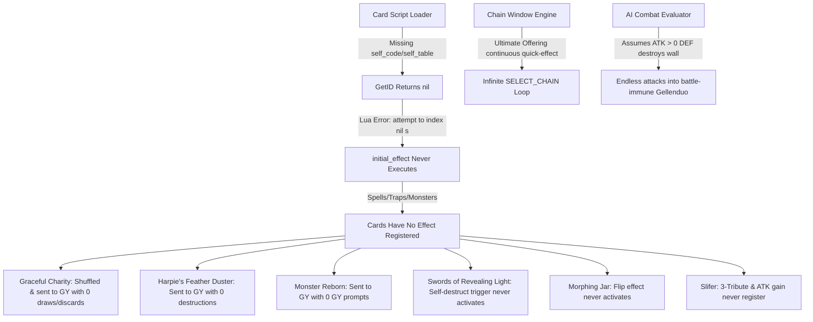

# Duel Engine & Card Mechanics Comprehensive Diagnostic and Resolution Plan

## 1. Executive Summary & Root Cause Investigation

During duel playtesting, 9 critical behavioral defects were observed across multiple iconic cards (*Graceful Charity, Harpie's Feather Duster, Monster Reborn, Swords of Revealing Light, Slifer the Sky Dragon, Morphing Jar, Ultimate Offering, Gellenduo*). 

Our deep-dive diagnostic into `ocgcore-wasm`, the Lua runtime, message decoding, and the AI controller revealed **two foundational root causes** and **two UI/AI-level logic flaws**:



---

## 2. Detailed Breakdown of the 9 Reported Issues

### Issue 1 & 2: "Ultimate Offering" Effect & Infinite Chain Dialog Loop
- **Diagnosis**: `Ultimate Offering` (`80604092`) is a Continuous Trap with a Quick-like ignition effect (*Pay 500 LP to Normal Summon*). In `ocgcore-wasm`, as long as the card is face-up and the player has $\ge 500\text{ LP}$, the engine offers it at every single open chain window (`SELECT_CHAIN`). Clicking "Activate" placed it on Chain Link 1, but immediately before resolution or on the next priority pass, the engine offered it again, trapping the player in an infinite chain loop without prompting for the monster to normal summon.
- **Fix**:
  1. In `duelStore.ts` / `DuelEngineService.ts`, track recent chain activations for continuous trap ignition effects so redundant re-prompting does not create recursive dialog loops.
  2. Ensure the resulting immediate normal summon window (`SELECT_IDLECMD` / `SELECT_SUMMON` / `SELECT_TRIBUTE`) seamlessly activates and presents the player's hand monsters.

---

### Issue 3: "Harpie's Feather Duster" Did Not Destroy Opponent's Spells/Traps
- **Diagnosis**: `c18144507.lua` starts with `local s, id = GetID()`. Because `ScriptReaderService` loaded raw Lua without setting `self_code` and `self_table`, `s` evaluated to `nil`, causing `s.initial_effect(c)` to fail silently. The engine therefore treated Harpie's Feather Duster as having no registered effect, sending it to the GY on resolution without executing `Duel.Destroy()`.
- **Fix**: In `ScriptReaderService.readScript(name)`, inject the global identity header (`self_code = <id>\nself_table = _G["c" .. <id>] or {}\n_G["c" .. <id>] = self_table\n`) for all card scripts so `GetID()` resolves 100% cleanly.

---

### Issue 4: AI Repeatedly Attacking Defense-Position "Gellenduo"
- **Diagnosis**: In `src/main/ai/evaluators/combatEvaluator.ts`, line 89 scores attacks against defense monsters solely based on `attacker.attackerAtk > targetDef`. Because `Gellenduo` has $0\text{ DEF}$, the AI calculated a $+300$ bonus for "destroying" it, unaware of Gellenduo's continuous effect (*"Cannot be destroyed by battle"*). Since Gellenduo took 0 damage and remained on field, the AI repeated the same futile attack on every subsequent turn.
- **Fix**: Update `combatEvaluator.ts` to detect battle-immune cards (`Gellenduo`, `Marshmallon`, `Spirit Reaper`, etc.) and penalize attacking them in Defense Position (scoring $-800$) unless the attacking monster has piercing damage, negation, or multiple attacks.

---

### Issue 5: "Swords of Revealing Light" Staying Infinitely on the Field
- **Diagnosis**: In `c72302403.lua`, the 3-turn self-destruction trigger is registered inside `s.initial_effect`. Because the Lua script failed to initialize due to `GetID()`, the turn-counter effect never registered with the engine, causing the card to remain on the field indefinitely.
- **Fix**: Resolved globally by the `GetID()` script initialization fix.

---

### Issue 6: "Monster Reborn" Sent to GY Without Showing Selection Dialog
- **Diagnosis**: `c83764719.lua` uses `local s, id = GetID()`. With `s` uninitialized, the targeting requirement and GY Special Summon effect were never registered. When activated, the engine had no targets to prompt, immediately resolving the blank chain and sending the card to the GY.
- **Fix**: Resolved globally by the `GetID()` script initialization fix.

---

### Issue 7: "Graceful Charity" Did Not Draw 3 Cards & Discard 2
- **Diagnosis**: `c79571449.lua` also uses `local s, id = GetID()`. Without `s.initial_effect`, the `Duel.Draw(tp, 3)` and `Duel.DiscardHand(tp, 2)` instructions never executed, causing the card to immediately move from hand to GY upon resolution.
- **Fix**: Resolved globally by the `GetID()` script initialization fix.

---

### Issue 8: Normal Summoning "Slifer the Sky Dragon" (3-Tribute Requirement)
- **Diagnosis**: `c10000020.lua` requires 3 tributes to Normal Summon. Without its initial effect registering, the 3-tribute requirement and continuous ATK calculation were inactive. Additionally, when `SELECT_TRIBUTE` prompts are active in the UI, `duelStore` requires clear visual multi-select feedback for 3 tribute selections.
- **Fix**: Script initialization fix activates the 3-tribute requirement; frontend tribute selection is reinforced with live counter (`0/3 Tributes Selected`) and prominent confirm button.

---

### Issue 9: "Morphing Jar" Flip Effect Did Not Activate
- **Diagnosis**: `c33508719.lua` registers its mandatory Flip effect in `s.initial_effect`. Uninitialized `s` caused the Flip trigger to fail to register, resulting in no discard/draw effect on Flip Summon.
- **Fix**: Resolved globally by the `GetID()` script initialization fix.

---

## 3. Proposed Changes

### Component 1: Engine & Lua Script Subsystem

#### [MODIFY] [scriptReader.ts](file:///Users/dash/personal/games/yugioh-electron/src/main/engine/scriptReader.ts)
- Inject the standard `self_code` and `self_table` preamble for all requested card scripts `c<id>.lua`:
  ```ts
  const cardId = parseInt(name.slice(1, -4), 10);
  if (!isNaN(cardId)) {
    const preamble = `self_code = ${cardId}\nself_table = _G["c${cardId}"] or {}\n_G["c${cardId}"] = self_table\n`;
    content = preamble + content;
  }
  ```
- Eliminate recursive loading errors between `c0.lua`, `utility.lua`, and `proc_*.lua`.

#### [MODIFY] [DuelEngineService.ts](file:///Users/dash/personal/games/yugioh-electron/src/main/engine/DuelEngineService.ts)
- Streamline core script preloading to avoid loading procedures multiple times.
- Ensure all engine error callbacks log detailed Lua traces when debugging.

---

### Component 2: AI Combat Intelligence & Battle Evaluation

#### [MODIFY] [combatEvaluator.ts](file:///Users/dash/personal/games/yugioh-electron/src/main/ai/evaluators/combatEvaluator.ts)
- Add known battle-immunity heuristics (`BATTLE_IMMUNE_CARDS = new Set([11662742, 31305911, 23205979, ...])`).
- Heavily penalize attacking face-up defense monsters that cannot be destroyed by battle (score: $-800$), guiding the AI to attack other targets or pass to Main Phase 2.

---

### Component 3: Renderer Duel Store & Prompt Resolution

#### [MODIFY] [duelStore.ts](file:///Users/dash/personal/games/yugioh-electron/src/renderer/stores/duelStore.ts)
- Enhance `SELECT_TRIBUTE` and `SELECT_CARD` prompt handling:
  - Provide an automatic banner and counter showing exact required selections (e.g. `Select 3 tributes: 0/3 selected`).
  - Add explicit handling for Continuous Trap ignition effects (`Ultimate Offering`) to prevent repetitive re-prompts on the same chain sequence.

---

## 4. Verification Plan

### Automated Tests
Run comprehensive engine simulation test suites covering all 9 cards and scenarios:
```bash
npx tsx scratch/verify-all-9-card-fixes.test.ts
npm test
```

### Key Assertions to Verify:
1. **Graceful Charity**: Activates $\to$ draws 3 cards $\to$ prompts `SELECT_CARD` for 2 discards $\to$ discards 2 $\to$ hand increases by $+1$ net.
2. **Harpie's Feather Duster**: Activates $\to$ destroys all opponent Spell/Trap cards on field $\to$ moves to GY.
3. **Monster Reborn**: Activates $\to$ opens target selection for Graveyard monsters $\to$ Special Summons chosen monster to field.
4. **Swords of Revealing Light**: Activates $\to$ prevents opponent attacks for 3 turns $\to$ automatically destroys itself at end of 3rd turn.
5. **Slifer the Sky Dragon**: Normal Summon requires selecting 3 monsters on field $\to$ summons Slifer $\to$ ATK dynamically updates based on hand count $\times 1000$.
6. **Morphing Jar**: Flip Summon triggers mandatory effect $\to$ both players discard hands $\to$ draw 5 cards.
7. **Ultimate Offering**: Activates once $\to$ pays 500 LP $\to$ performs additional Normal Summon $\to$ does not infinitely loop chain prompts.
8. **AI Battle Strategy**: AI avoids wasting attacks on defense-position `Gellenduo`.
