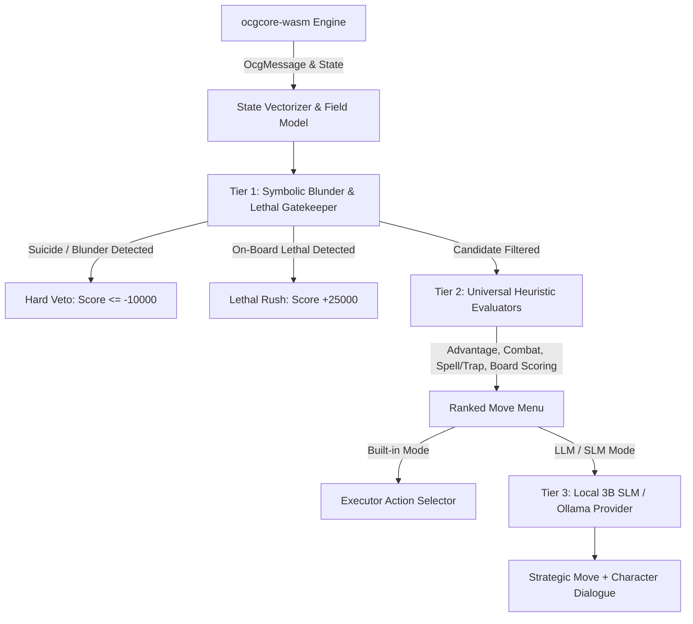

# 00: Master AI Architecture & Universal Game Engine Blueprint

## 1. Executive Summary

This architecture defines the **Grandmaster Hybrid AI Engine** for the Yu-Gi-Oh! arena. Rather than relying on fragile, card-specific hardcoding or pure neural networks prone to latency and hallucinations, the engine employs a **3-Tier Neuro-Symbolic Pipeline**:



This ensures that the AI:
1. **Never blunders away won games** (e.g. activating *Card Destruction* when holding overwhelming lethal dominance).
2. **Understands macro-game win conditions** (direct lethal, board dominance, tempo vs card advantage).
3. **Works universally for ANY card or deck** chosen from the 5,676 cards in `resources/cards.cdb`.
4. **Responds in < 5ms** on local heuristics and < 150ms on local SLMs (via Ollama / Apple Silicon Metal).

---

## 2. Card Database Inventory & Taxonomy (`resources/cards.cdb`)

A complete scan of `resources/cards.cdb` reveals **5,676 total cards** spanning the classic Retro, DM, GX, and 5D's eras:

| Category | Count | Percentage | Key Mechanics & Archetypes |
| :--- | :--- | :--- | :--- |
| **Total Database** | **5,676** | 100% | Full Edison / Retro / 5D's card pool |
| **Monsters** | **3,648** | 64.3% | Normal, Effect, Fusion, Synchro, Ritual, Flip, Tuners |
| - *Normal Monsters* | 522 | 9.2% | Vanilla beatsticks & tribute bodies |
| - *Effect Monsters* | 3,068 | 54.1% | Trigger, Continuous, Quick, Ignition effects |
| - *Fusion Monsters* | 284 | 5.0% | HERO, Cyber Dragon, Gladiator Beast contact fusions |
| - *Synchro Monsters* | 165 | 2.9% | Level 5-10 bosses (Stardust, Goyo, Colossal, Brionac) |
| - *Tuner Monsters* | 232 | 4.1% | Synchro enablers (Plaguespreader, Gale, Krebons) |
| - *Flip Effect Monsters* | 115 | 2.0% | Cyber Jar, Morphing Jar, Man-Eater Bug, Ryko |
| - *Ritual Monsters* | 86 | 1.5% | Demise, Relinquished, BLS, Herald of Perfection |
| **Spells** | **1,149** | 20.2% | Normal, Quick-Play, Continuous, Equip, Field |
| - *Normal Spells* | 486 | 8.6% | Raigeki, Dark Hole, Pot of Greed, RotA, Trade-In |
| - *Quick-Play Spells* | 181 | 3.2% | Book of Moon, Enemy Controller, MST, Shrink |
| - *Continuous Spells* | 186 | 3.3% | Wave-Motion Cannon, Solidarity, Black Whirlwind |
| - *Equip Spells* | 171 | 3.0% | United We Stand, Mage Power, Premature Burial |
| - *Field Spells* | 86 | 1.5% | Necrovalley, Geartown, Dark World, Sanctuary |
| **Traps** | **879** | 15.5% | Normal, Continuous, Counter |
| - *Normal Traps* | 571 | 10.1% | Mirror Force, Torrential Tribute, Dimensional Prison |
| - *Continuous Traps* | 231 | 4.1% | Royal Oppression, Skill Drain, Call of the Haunted |
| - *Counter Traps* | 77 | 1.4% | Solemn Judgment, Solemn Warning, Dark Bribe |

---

## 3. The 3-Tier Hybrid Engine Architecture

### Tier 1: Symbolic Blunder & Lethal Gatekeeper (0ms)
- **Macro Dominance Detection**:
  - Monitors `aiTotalAtk`, `oppVisibleAtk`, `oppMonsterCount`, and `oppLp`.
  - Flags `isDominating: true` and `isLethalOnBoard: true`.
- **Symmetrical Card Veto**:
  - Vetoes `Card Destruction` (72892473/72892420), `Hand Destruction` (74519184), `Morphing Jar` (33508719), `Reload` (22589918), and `Magical Mallet` (85852291) with score `-15000` when dominating or in Main Phase 2.
- **Lethal Rush Activation**:
  - If ready on-board attackers total ATK $\ge$ Opponent LP with clear path, elevates `TO_BP` score to `+25000`.
- **Suicide Prevention**:
  - Vetoes attacks into superior monsters, Ring of Destruction that inflicts self-lethal damage, and normal summoning 0 ATK monsters in attack position.

### Tier 2: Universal Heuristic Evaluators (1ms - 2ms)
The heuristic layer breaks down game state across 4 modular evaluation engines:
1. **`boardEvaluator.ts`**: Calculates field presence, zone control, and active threats.
2. **`combatEvaluator.ts`**: Simulates battle math, defense piercing, damage step triggers, and optimal attack ordering.
3. **`spellTrapEvaluator.ts`**: Evaluates card advantage, board wipes, reactive backrow setting, and chain negation.
4. **`advantageEvaluator.ts`**: Measures net tempo, card economy (hand + field), and graveyard recursion potential.

### Tier 3: Strategic Planning / Local SLM (50ms - 150ms)
- Activated when the AI is set to an LLM provider (Ollama, Groq, DeepSeek, Gemini).
- Filters candidates to top 3-5 non-blunder choices (`score > -2000`).
- Model receives structured board state, available legal actions, and persona instructions.
- Returns exact JSON choice with character dialogue and strategic reasoning.

---

## 4. Universal Game State Representation

Every AI decision operates on a sanitized, anti-cheat validated state (`EvaluatorContext`):

```typescript
export interface EvaluatorContext {
  boardState: DuelBoardState;         // Full field state (User and AI)
  aiPlayerId: 0 | 1;                  // AI player ID
  personality: CharacterPersonality;  // Aggression, Defensiveness, Risk, Combo weights
  cardReader: CardReaderService;      // SQLite access to texts and datas
  signatureCardIds: number[];         // Character favorite cards
  aiDeckCards: number[];              // Main deck card codes
  deckArchetype?: string;             // Resolved archetype strategy
  currentPhase: DuelPhase;            // DP, SP, M1, BP, M2, EP
  currentTurn: number;                // Turn counter (1-based)
  activeChainCards?: number[];        // Card codes currently in unresolved chain
}
```

---

## 5. Phased Roadmap to Legendary Status

- [x] **Phase 1: Lethal & Dominance Gatekeeper**: Hard veto on Card Destruction / hand refresh blunders, instant Battle Phase lethal rush.
- [ ] **Phase 2: Universal Combat Mastery**: Attack ordering, baiting Mirror Force/Gorz, damage step combat tricks (Honest/Kalut/Shrink).
- [ ] **Phase 3: Universal Spell/Trap Engine**: Comprehensive rules for all 2,028 Spells & Traps in `cards.cdb`.
- [ ] **Phase 4: Monster Summoning & Extra Deck Engine**: Smart tribute math, Tuner + non-Tuner Synchro calculator, Fusion optimization.
- [ ] **Phase 5: Chain Reaction & Counter Trap Hierarchy**: Chain priority, anti-self-chaining, negation target ranking.
- [ ] **Phase 6: Macro Game Discipline**: Playing around Heavy Storm, tempo vs advantage, Main Phase 2 economy.
