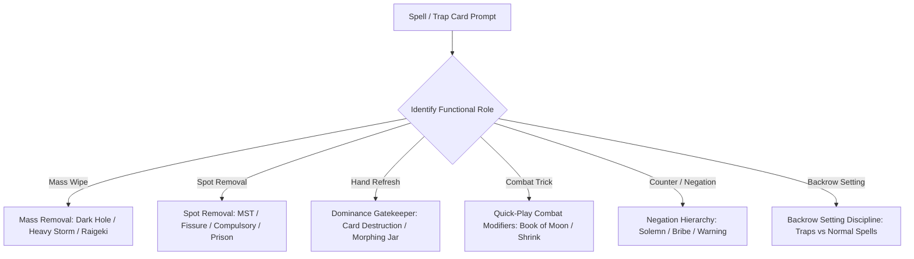

# 02: Universal Spell & Trap Engine (2,028 Cards)

## 1. Engine Scope & Principles

In `resources/cards.cdb`, Spells (1,149 cards) and Traps (879 cards) represent **35.7%** of the entire database. This engine establishes universal evaluation rules that govern every card category without requiring hardcoded scripts for all 2,028 individual cards.

---

## 2. Mass Removal & Board Wipers

### 2.1 Mass Monster Removal
- **Raigeki (12580477)**: One-sided board wipe.
  - *Condition*: Opponent monster count $\ge 1$.
  - *Score*: $800 + \text{oppMonsters} \times 400 \times (\text{aggression} + 0.5)$. Hold if opponent has 0 monsters.
- **Dark Hole (53129443)**: Symmetrical board wipe.
  - *Rule*: Only activate if:
    1. AI controls 0 monsters and opponent controls $\ge 1$ monster; OR
    2. Opponent controls a boss monster that AI cannot overcome by battle; OR
    3. Opponent monster count $>$ AI monster count.
  - *Veto*: If AI controls more monsters than opponent and no enemy threat exists, score is $-4000$ (`[SELF-WIPE VETO]`).
- **Lightning Vortex (63590062)**: Requires discarding 1 card to wipe face-up opponent monsters.
  - *Condition*: Opponent controls $\ge 2$ face-up monsters and AI has expendable discard fodder.

### 2.2 Mass Backrow Removal
- **Heavy Storm (19613556)**: Destroys ALL Spells and Traps on the field.
  - *Self-Destruction Penalty*: If AI controls $\ge 2$ set Spell/Trap cards, penalize Heavy Storm by $-3000 \times \text{aiBackrowCount}$.
  - *Optimal Timing*: Cast before setting AI's own backrow in Main Phase 1 or 2.
- **Harpie's Feather Duster (18144506)**: One-sided backrow wipe.
  - *Rule*: Highest priority activation whenever opponent controls $\ge 1$ backrow card.
- **Giant Trunade (42703248)**: Bounces all Spells and Traps to hand.
  - *OTK Enabler*: Cast immediately before going for lethal in Battle Phase to remove all reactive backrow without triggering destruction effects (e.g. *Geartown*, *Stardust Dragon*).

---

## 3. The Lethal & Dominance Gatekeeper (Symmetrical Cards)

Symmetrical cards that refresh or cycle both players' hands (*Card Destruction* [72892473], *Hand Destruction* [74519184], *Morphing Jar* [33508719], *Reload* [22589918], *Magical Mallet* [85852291]) are double-edged swords.

### Gatekeeper Rules:
1. **Dominance Veto**: If AI controls on-board lethal OR $\ge 4000$ ATK against an empty field, **hard veto with score $-15000$**.
2. **Main Phase 2 Veto**: Never activate in MP2 if AI has monster presence or LP superiority. Refilling the opponent's hand directly before their turn gives them free answers.
3. **Turn 1 Veto**: Never activate on Turn 1 if going first (gives opponent free 5-card GY setup and a fresh hand).
4. **Card Advantage Balance**: Only activate if AI hand count $>$ opponent hand count AND AI needs to filter cards.

---

## 4. Quick-Play Spells & Combat Tricks

Quick-Play Spells (*Book of Moon* [14087893], *Enemy Controller* [98045062], *Shrink* [55713623], *Rush Recklessly* [70046172], *Mystical Space Typhoon* [5318639]):

### 4.1 Hand Retention in Main Phase 1
- **Critical Game Mechanic**: A Quick-Play Spell that is set face-down **cannot be activated during the turn it is set**.
- Setting a Quick-Play Spell in Main Phase 1 before combat prevents using it during the Battle Phase!
- **Rule**: In MP1, keep Quick-Play Spells in hand (`score: -3500` to set) so they can be cast directly from hand during combat or in response to opponent effects.

### 4.2 Main Phase 2 Backrow Setting
- Once the Battle Phase is complete, setting Quick-Play Spells face-down in MP2 is rewarded with a `+1400` phase bonus, arming them for the opponent's turn.

---

## 5. Backrow Setting Discipline

### 5.1 Normal Spell Setting Prohibition
- Normal Spells (e.g. *Raigeki*, *Dark Hole*, *Fissure*, *Polymerization*, *Pot of Greed*) **cannot be activated on the opponent's turn**.
- Setting them face-down:
  1. Grants 0 defense.
  2. Clogs backrow zones (limiting space for actual traps).
  3. Exposes valuable cards to destruction by opponent's *Heavy Storm* or *MST*.
- **Rule**: Hard penalty (`score: -4500`) against setting Normal Spells face-down, unless hand size exceeds 6 cards and AI must avoid End Phase discard.

### 5.2 Win Condition Backrow Preservation (Destiny Board)
- When *Destiny Board* (94212438) is active on the field:
  - It requires 4 open Spell/Trap zones to place *Spirit Message "I"*, *"N"*, *"A"*, *"L"*.
  - **Rule**: If `openBackrowZones < remainingMessagesNeeded` and *Dark Sanctuary* is not active, veto setting any spells/traps (`score: -9500`).

---

## 6. Counter Traps & Negation Hierarchy

Counter Traps operate at **Spell Speed 3** (the fastest speed in the game).

| Card | ID | Cost / Trigger | Optimal AI Target Policy |
| :--- | :--- | :--- | :--- |
| **Solemn Judgment** | 41420027 | Half LP | Negate game-ending spells (Raigeki, Dark Hole, Heavy Storm) or Boss Monster summons. **Never negate a weak <1500 ATK summon unless it has a lethal search effect**. |
| **Solemn Warning** | 84749824 | 2000 LP | Negate Special Summons (Cyber Dragon, Synchro, Fusion, Monster Reborn). Hold if AI LP $\le 2500$. |
| **Dark Bribe** | 77414722 | Opponent draws 1 | Only negate opponent board-clearing spells/traps, not minor card filtering. |
| **Gladiator Beast War Chariot** | 96218082 | Control GB monster | Negate monster effects on field or in hand (Gorz, Honest, Tragoedia). |
