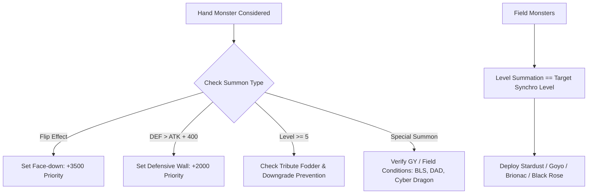

# 03: Monster Summoning, Tributes & Extra Deck Engine

## 1. Engine Scope & Principles

Monsters constitute **3,648 cards (64.3%)** of the card database. Making the AI a legendary duelist requires robust decision matrices for:
1. **Normal Summons vs Monster Sets** (Turn 1 tempo, Flip effects, defensive walls).
2. **Smart Tribute Math & Fodder Selection** (Level 5-6 requires 1, Level 7+ requires 2).
3. **Inherent Special Summons** (Cyber Dragon, Chaos monsters, Dark Armed Dragon).
4. **Extra Deck Summoning Math** (Synchro Level Combinatorics & Fusion Materials).

---

## 2. Normal Summoning vs Setting Discipline

### 2.1 Flip Effect Monsters (115 Cards in Pool)
- **Cards**: *Cyber Jar* (34124316), *Morphing Jar* (33508719), *Man-Eater Bug* (54652250), *Magician of Faith* (31560081), *Ryko, Lightsworn Hunter* (21502796).
- **Hard Rule**: **NEVER** Normal Summon a Flip Effect monster in Attack Position.
  - Doing so exposes weak stats (e.g. 500/400 for Man-Eater Bug), wastes the flip effect, and invites an easy attack.
  - **Scoring**: Normal Summoning Flip monster receives $-15000$ penalty. Setting face-down receives $+3500$ priority.

### 2.2 Turn 1 Opening Moves
- On Turn 1, the turn player **cannot declare an attack**.
- If a monster's $\text{DEF} > \text{ATK}$ (e.g. *Elemental HERO Clayman* 800/2000, *Mystical Elf* 800/2000, *Big Shield Gardna* 100/2600):
  - Normal Summoning in Attack Position leaves it vulnerable to being destroyed by the opponent's first attack on Turn 2.
  - **Rule**: Set face-down on Turn 1 (`+2500` priority score).

### 2.3 Slifer & Floodgate Avoidance
- If the opponent controls *Slifer the Sky Dragon* (10000020), any monster Normal or Special Summoned in Attack Position with $\le 2000$ ATK has its ATK reduced by 2000 and is immediately destroyed if reduced to 0.
- If the opponent controls *King Tiger Wanghu* (83986578), monsters with $\le 1400$ ATK are instantly destroyed upon summon.
- **Rule**: Avoid Normal Summoning into Slifer/Wanghu destruction; set in Defense Position instead.

---

## 3. Tribute Summoning & Fodder Selection

Tribute Summoning requires sacrificing field assets for a higher-level boss monster.

### 3.1 Downgrade Prevention
- **Golden Rule**: **NEVER tribute a monster with higher ATK to summon a monster with lower ATK** (e.g. tributing a 2800 ATK *Dark Armed Dragon* to summon a 2400 ATK *Caius the Shadow Monarch*), unless the tribute monster has an immediate game-winning or removal effect that solves an insurmountable threat.
- **Scoring**: Downgrade penalty of $-8000$.

### 3.2 Fodder Prioritization
When selecting which monsters to tribute for Level 5-6 (1 tribute) or Level 7+ (2 tributes):
1. **First Choice**: Tokens (e.g. Sheep Tokens, Dendle Tokens), 0 ATK monsters, or monsters with negative stats.
2. **Second Choice**: Spent utility monsters whose on-summon effects have already resolved (e.g. *Elemental HERO Stratos*, *Sangan*, *Breaker the Magical Warrior* with 0 counters).
3. **Forbidden Sacrifices**:
   - Continuous floodgate monsters (e.g. *Jinzo*, *Vanity's Fiend*, *Fossil Dyna*).
   - Indestructible stall walls (*Marshmallon*, *Spirit Reaper*, *Arcana Force 0 - The Fool*) when facing an opponent boss monster.

---

## 4. Special Summons & Iconic Boss Monsters

### 4.1 Cyber Dragon (70095154)
- *Inherent Summon*: Special Summons from hand if opponent controls a monster and AI controls none.
- *Execution*: Always deploy Cyber Dragon **first** before conducting the Normal Summon of the turn to establish 2 monsters on field for Synchro or Tribute.

### 4.2 Chaos Monsters (BLS & Chaos Sorcerer)
- **Black Luster Soldier - Envoy of the Beginning (72989439)**: Banishes 1 LIGHT and 1 DARK from GY.
  - Priority: Activate banish removal against indestructible/high-threat monsters, or attack twice for game.
- **Chaos Sorcerer (9596126)**: Banishes 1 face-up monster. Priority target: Boss monsters and untargetable threats.

### 4.3 Dark Armed Dragon (65192027)
- *Summon Condition*: Exactly 3 DARK monsters in Graveyard.
- *Removal Effect*: Banish 1 DARK from GY to target and destroy 1 card on the field.
- *AI Strategy*: When DAD hits the field, systematically pop opponent backrow threats first (to prevent Mirror Force / Torrential), then clear monster zones before attacking.

---

## 5. Synchro & Fusion Extra Deck Combinatorics

### 5.1 Synchro Level Arithmetic (165 Synchros, 232 Tuners)
The AI evaluates all possible pairings of face-up Tuners and non-Tuners:
$$\text{Level}(\text{Tuner}) + \sum \text{Level}(\text{Non-Tuners}) = \text{Target Synchro Level}$$

| Level | Premier Synchro Bosses | Strategic Role |
| :--- | :--- | :--- |
| **Level 6** | *Brionac, Dragon of the Ice Barrier* (50321796) | Discards cards to bounce entire enemy board to hand. |
| **Level 6** | *Goyo Guardian* (7391448) | 2800 ATK beatstick; steals destroyed monsters to AI's side. |
| **Level 7** | *Black Rose Dragon* (73580471) | Destroys ALL cards on field (emergency board reset). |
| **Level 8** | *Stardust Dragon* (44508094) | Tributes itself to negate any destruction effect (Mirror Force, Dark Hole). |
| **Level 8** | *Colossal Fighter* (23693634) | Gains 100 ATK per Warrior in all GYs; revives itself when destroyed. |

### 5.2 Fusion Summoning & Contact Fusions (284 Fusions)
- **Polymerization / Miracle Fusion**: Only activate when the resulting Fusion monster provides superior field presence compared to the separate materials.
- **Gladiator Beast Contact Fusions**: *Gyzarus* (pops 2 cards on field upon summon) and *Heraklinos* (discards 1 card to negate any Spell/Trap).
