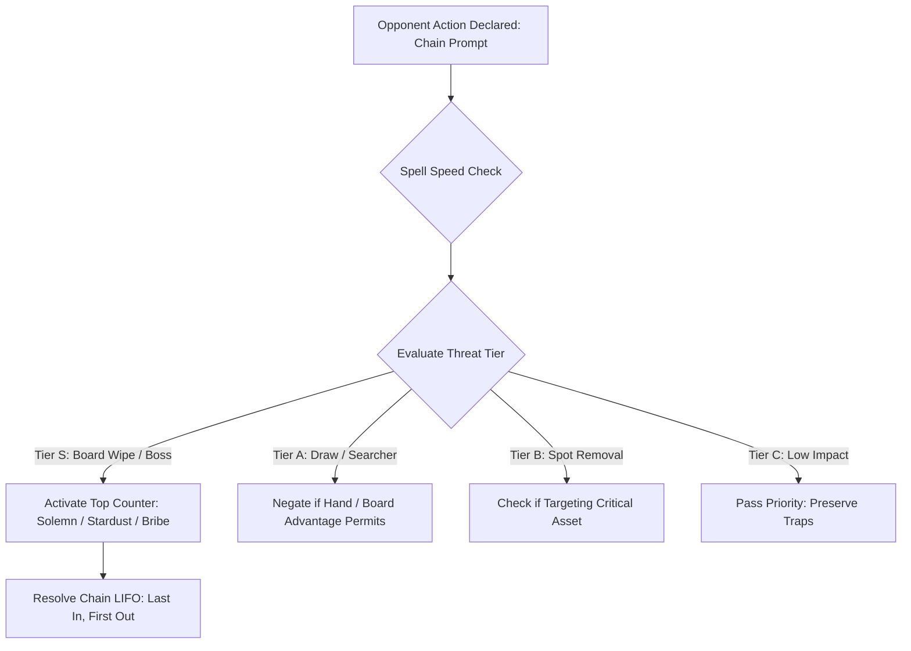

# 04: Chain Reaction & Negation Hierarchy Engine

## 1. Tactical Overview

The Chain is the core interaction vehicle in competitive Yu-Gi-Oh!. Poor AIs chain frivolously (e.g. wasting *Solemn Judgment* to negate a 1000 ATK vanilla monster, or chaining *Compulsory Evacuation Device* to their own monster). A legendary AI understands **Spell Speeds**, **Chain Priority**, and **Negation Value Hierarchy**.



---

## 2. Negation Target Hierarchy

When the AI holds negation counter-measures (*Solemn Judgment*, *Solemn Warning*, *Dark Bribe*, *Gladiator Beast War Chariot*, *Stardust Dragon*, *Effect Veiler*), the target is scored based on the following hierarchy:

| Tier | Threat Level | Card Examples | AI Negation Policy |
| :--- | :--- | :--- | :--- |
| **Tier S** | **Existential Board Threats** | *Raigeki*, *Dark Hole*, *Heavy Storm*, *Giant Trunade*, *Black Rose Dragon*, *Judgment Dragon*, *Future Fusion* | **100% Mandatory Negation**. Pay any LP cost (including Solemn Judgment's half LP) because resolving these cards leads to immediate defeat. |
| **Tier A** | **Major Card Advantage Engines** | *Pot of Greed*, *Graceful Charity*, *Destiny Draw*, *Reinforcement of the Army*, *Elemental HERO Stratos*, *Allure of Darkness* | **High Priority Negation**. Negate to choke opponent's resource acceleration. |
| **Tier B** | **Spot Removal & High-ATK Attackers** | *Smashing Ground*, *Fissure*, *Dimensional Prison*, *Compulsory Evacuation Device*, 2400+ ATK Boss Summons | **Selective Negation**. Only negate if the card targets AI's sole boss monster or prevents lethal on the upcoming turn. |
| **Tier C** | **Low-Impact / Frivolous Actions** | Normal Summons with $\le 1600$ ATK and no on-summon search effect, minor burn spells (e.g. *Sparks*, *Ookazi*) | **STRICTLY PASS**. Do not waste counter traps or life points on non-threatening actions. |

---

## 3. Anti-Self-Chain Loop Protection

- **The Problem**: In automated duel engines, an AI with multiple activatable copies of a card or quick effects (e.g. *Necro Gardna*, *Compulsory Evacuation Device*, *Book of Moon*) might trigger a secondary activation in response to its own initial activation, wasting cards and depleting its own backrow.
- **Symbolic Guardrail**:
  ```typescript
  if (context.activeChainCards && context.activeChainCards.includes(code)) {
    return {
      score: -10000,
      reason: `[HOLD] ${cardName} is already activated in the current chain (prevent self-chain loop)`,
    };
  }
  ```
- **Self-Targeting Guard**: Never target AI's own monsters with destructive removal (*Sakuretsu Armor*, *Ring of Destruction*, *Dimensional Prison*, *Bottomless Trap Hole*).

---

## 4. Hand Trap Timing Mastery

Hand Traps activate from the hand to disrupt the opponent during their turn without needing to be set on the field:

### 4.1 Effect Veiler (97268402)
- *Timing*: Opponent's Main Phase only. Discards from hand to negate 1 face-up effect monster on opponent's field until End Phase.
- *High-Value Targets*:
  - Ignition monster effects: *Brionac, Dragon of the Ice Barrier*, *Dark Armed Dragon*, *Judgment Dragon*, *Chaos Sorcerer*.
  - Searchers on summon: *Elemental HERO Stratos*, *Lonefire Blossom*, *Debris Dragon*.

### 4.2 D.D. Crow (24508238)
- *Timing*: Quick effect during either player's turn. Discards to banish 1 card from opponent's GY.
- *Interception Tactics*:
  - Chain directly to target-based graveyard revival spells (*Monster Reborn*, *Premature Burial*, *Call of the Haunted*, *Limit Reverse*).
  - Banishing the target in response causes the revival spell to **resolve without effect (whiff)**, scoring a massive +2 card advantage swing!
  - Banish *Treeborn Frog* or *Plaguespreader Zombie* when they declare ignition from the Graveyard.

---

## 5. Baiting Opponent Counters

Against opponents holding suspected counter traps (*Solemn Judgment*, *Dark Bribe*):
1. **Sacrificial Baiting**:
   - Cast a secondary threat first (e.g. *Mystical Space Typhoon* or *Lightning Vortex*).
   - If the opponent negates it, their counter trap is consumed and their LP or hand is reduced.
2. **Dropping the True Threat**:
   - Once the counter window is closed, proceed with the primary play (e.g. summoning *Judgment Dragon*, activating *Future Fusion*, or Normal Summoning the key combo piece).
