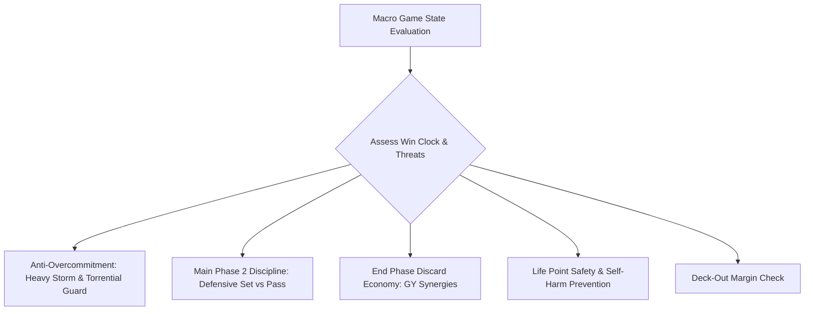

# 05: Macro Game State, Tempo & Turn Discipline

## 1. Tactical Overview

The greatest failure of primitive game AIs is **lack of macro-perspective**. They make locally optimal moves that lead to globally catastrophic results—such as Aster Phoenix setting up an insurmountable 7,700 ATK board on Turn 2, and then casting *Card Destruction* to gift the opponent an Exodia victory.

This plan formalizes the **Macro Discipline Rules** that govern tempo, board commitment, Main Phase 2 behavior, and life point preservation.

---

## 2. Anti-Overcommitment: Playing Around Iconic Blowouts

### 2.1 The Heavy Storm Threshold
- *Heavy Storm* (19613556) destroys ALL Spells and Traps on the field.
- **Rule**: If the opponent has not yet played Heavy Storm and AI does NOT control negation (*Solemn Judgment*, *Stardust Dragon*, *Dark Bribe*):
  - **Maximum Set Limit**: Do not set more than **2 backrow cards**.
  - Setting 3, 4, or 5 backrow cards without protection invites a game-ending $-3$ or $-4$ card blowout.

### 2.2 The Mirror Force & Torrential Tribute Threshold
- If the AI already controls $\ge 2$ monsters with sufficient ATK to maintain lethal pressure (e.g. $\ge 4000$ total ATK):
  - Do NOT commit additional monsters to the field into an unknown opponent set card.
  - Doing so walks directly into *Mirror Force* (44095762) or *Torrential Tribute* (53582587).
  - Hold reserve monsters in hand so the AI can immediately rebuild its board if wiped.

---

## 3. Main Phase 2 Discipline

Main Phase 2 exists to consolidate defense, prepare for the opponent's upcoming turn, and set traps. It is NOT a phase for frivolous card cycling.

### 3.1 MP2 Symmetrical Card Prohibition
- **Absolute Prohibition**: Never activate *Card Destruction*, *Hand Destruction*, *Morphing Jar*, or *Reload* in Main Phase 2 unless the AI has 0 monsters, desperate LP deficit, and zero playable cards.
- **Rationale**: Any cards drawn by the opponent in MP2 are immediately playable on their upcoming turn, giving them full tactical advantage.

### 3.2 MP2 Defensive Setting
- **Traps & Quick-Play Spells**: Priority shifts to setting reactive backrow (*Mirror Force*, *Solemn Judgment*, *Book of Moon*, *Dimensional Prison*) to protect the board during the opponent's turn.
- **Discipline Pass**: When controlling board dominance in MP2, `TO_EP` receives high priority (`+1500`) to pass turn cleanly.

---

## 4. End Phase Hand Limit & Graveyard Synergy

When ending turn with $> 6$ cards in hand, the turn player must discard down to 6:

### 4.1 Optimal Discard Priority
1. **Graveyard Triggers & Enablers** (`Score: +5000`):
   - *Destiny HERO - Malicious* (60010174): Banishes to summon another from deck.
   - *Treeborn Frog* (12538374): Revives each Standby Phase if no S/T on field.
   - *Mezuki* (92826944): Banishes to revive any Zombie from GY.
   - *Necro Gardna* (4906301): Banishes to negate an attack.
   - *Dandylion* (15341821): Spawns 2 Fluff Tokens when sent to GY.
2. **High-Level Dead Draws without Tribute Fodder**: High-level boss monsters that can be revived via *Monster Reborn* or *Call of the Haunted*.
3. **Redundant Copies of Unsearchable Cards**.
4. **Never Discard**: Core win conditions (Exodia pieces), sole removal cards (Raigeki, Dark Hole), or premier defensive traps.

---

## 5. Life Point & Self-Harm Safety Gate

1. **Ring of Destruction (83555666)**:
   - Inflicts damage equal to destroyed monster's ATK to BOTH players.
   - **Suicide Veto**: If target ATK $\ge$ AI's remaining LP, score is $-10000$ (`[SUICIDE PREVENTION]`).
2. **Solemn Judgment (41420027)**:
   - Costs half LP. While it cannot cause self-lethal, paying half LP when AI is at $\le 1000$ LP leaves AI vulnerable to burn or direct poke. Only pay if stopping guaranteed lethal.
3. **Deck-Out Awareness**:
   - If AI deck count $\le 3$, immediately veto all draw cards (*Pot of Greed*, *Destiny Draw*, *Solar Recharge*) that would cause self deck-out loss.
